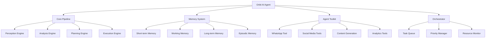

# 🤖 Orbit AI Agent

## Agente de IA Autónomo para Marketing Digital

**Orbit AI Agent** es un sistema de inteligencia artificial completamente autónomo diseñado para revolucionar el marketing digital. Inspirado en las mejores prácticas de sistemas como Sintra AI, este agente combina múltiples modelos de IA, memoria contextual avanzada y capacidades de ejecución autónoma para proporcionar una experiencia de marketing completamente automatizada.

---

## 🌟 Características Principales

### 🧠 **Sistema Cognitivo Avanzado**
- **Pipeline Cognitivo Completo**: Percepción → Análisis → Planificación → Decisión → Ejecución → Aprendizaje
- **Memoria Multi-Capa**: Memoria de corto plazo, de trabajo, largo plazo y episódica
- **Aprendizaje Continuo**: El agente mejora con cada interacción y experiencia

### 🚀 **Autonomía Completa**
- **Rutinas Matutinas Automáticas**: Análisis diario y generación de contenido
- **Monitoreo 24/7**: Supervisión continua de campañas y métricas
- **Respuesta Proactiva**: Reacciona automáticamente a cambios y oportunidades

### 🛠️ **Toolkit Completo**
- **WhatsApp Business**: Automatización de mensajes y campañas
- **Redes Sociales**: Instagram, Facebook, TikTok, LinkedIn
- **Generación de Contenido**: Textos, imágenes, videos adaptados por plataforma
- **Email Marketing**: Campañas automatizadas con SendGrid/Mailchimp
- **Analytics Avanzado**: Análisis profundo de performance y ROI

### 🔗 **Integración Total**
- **APIs Múltiples**: OpenAI, Claude, Gemini para máxima versatilidad
- **Base de Datos Vectorial**: PGVector para búsqueda semántica avanzada
- **Cache Inteligente**: Redis para performance óptima
- **Webhooks**: Comunicación en tiempo real con sistemas externos

---

## 🏗️ Arquitectura del Sistema



---

## 🚀 Instalación y Configuración

### Prerrequisitos

```bash
# Node.js 20+
node --version

# Docker y Docker Compose
docker --version
docker-compose --version

# PostgreSQL con extensión PGVector
# Redis para cache
```

### 1. Clonar el Repositorio

```bash
git clone https://github.com/tu-usuario/orbit-simple-mkt.git
cd orbit-simple-mkt
```

### 2. Configurar Variables de Entorno

```bash
# Copiar archivo de ejemplo
cp .env.example .env

# Editar con tus credenciales
nano .env
```

### 3. Deployment con Docker

```bash
# Hacer ejecutable el script de deployment
chmod +x scripts/deploy.sh

# Ejecutar deployment completo
./scripts/deploy.sh

# Para deployment con logs en tiempo real
./scripts/deploy.sh --logs
```

### 4. Verificar Instalación

```bash
# Verificar servicios
docker-compose ps

# Health checks
curl http://localhost:3003/health
curl http://localhost:3001/health
curl http://localhost:3000
```

---

## 📊 Panel de Control

Una vez desplegado, accede a:

- **🌐 Frontend**: [http://localhost:3000](http://localhost:3000)
- **🤖 Agente API**: [http://localhost:3003](http://localhost:3003)
- **🔧 Backend API**: [http://localhost:3001](http://localhost:3001)
- **📈 Prometheus**: [http://localhost:9090](http://localhost:9090)
- **📊 Grafana**: [http://localhost:3001](http://localhost:3001)

---

## 🔧 API del Agente

### Endpoints Principales

#### Chat con el Agente
```http
POST /agent/chat
Content-Type: application/json

{
  "message": "Genera una campaña para Instagram sobre productos ecológicos",
  "businessId": "business_123",
  "userId": "user_456",
  "sessionId": "session_789"
}
```

#### Generar Contenido
```http
POST /agent/content/generate
Content-Type: application/json

{
  "type": "post",
  "platform": "instagram",
  "audience": "millennials interesados en sostenibilidad",
  "businessProfile": {
    "name": "EcoVida",
    "industry": "Productos Ecológicos"
  }
}
```

#### Obtener Recomendaciones
```http
POST /agent/recommendations
Content-Type: application/json

{
  "businessProfile": {...},
  "metrics": {...},
  "context": "performance_optimization"
}
```

### WebSockets para Tiempo Real

```javascript
const ws = new WebSocket('ws://localhost:3003/ws');

ws.onmessage = (event) => {
  const data = JSON.parse(event.data);
  console.log('Agente:', data.message);
};

// Enviar mensaje
ws.send(JSON.stringify({
  type: 'chat',
  message: 'Analiza mi performance de esta semana'
}));
```

---

## 🧠 Sistema de Memoria

### Tipos de Memoria

1. **Memoria de Corto Plazo**
   - Almacena información de la sesión actual
   - Se borra al finalizar la conversación

2. **Memoria de Trabajo**
   - Cache LRU con persistencia en Redis
   - Información frecuentemente accedida

3. **Memoria de Largo Plazo**
   - Embeddings vectoriales en PGVector
   - Búsqueda semántica avanzada

4. **Memoria Episódica**
   - Experiencias completas y lessons learned
   - Patrones de comportamiento detectados

### Ejemplo de Uso de Memoria

```typescript
// Recordar información específica
const memories = await agent.memory.recall(
  "campañas exitosas de productos ecológicos",
  context,
  10 // límite de resultados
);

// Almacenar nueva experiencia
await agent.memory.store({
  content: "La campaña de Instagram aumentó engagement 45%",
  type: "success_pattern",
  importance: 0.8
}, context);
```

---

## 🤖 Workflows Autónomos

### Rutina Matutina (8:00 AM daily)

1. **Análisis de Métricas Nocturnas**
   - Revisa performance de contenido publicado
   - Identifica tendencias y oportunidades

2. **Generación de Contenido Diario**
   - Crea posts optimizados por plataforma
   - Adapta a tendencias actuales

3. **Planificación Estratégica**
   - Ajusta calendario editorial
   - Propone nuevas campañas

### Monitoreo Continuo

- **Respuesta a Comentarios**: Auto-respuesta inteligente
- **Seguimiento de Menciones**: Alertas y respuestas proactivas
- **Optimización de Anuncios**: Ajuste automático de parámetros

### Alertas Inteligentes

```javascript
// El agente envía alertas automáticas
{
  type: "performance_alert",
  message: "El CTR de tu anuncio bajó 15%. Sugiero ajustar el copy.",
  suggested_actions: ["update_copy", "adjust_targeting"],
  urgency: "medium"
}
```

---

## 🔄 Integración con Sistemas Existentes

### Webhook para Eventos del Sistema

```http
POST /webhooks/orbit-system
Content-Type: application/json

{
  "event": "user_registered",
  "data": {
    "userId": "user_123",
    "businessProfile": {...}
  }
}
```

### Sincronización de Datos

```typescript
// El agente se sincroniza automáticamente
await integration.syncUserData(userId, {
  preferences: {...},
  businessGoals: {...},
  performance: {...}
});
```

---

## 📈 Monitoreo y Analytics

### Métricas del Agente

- **Rendimiento de IA**: Tiempo de respuesta, accuracy
- **Uso de Recursos**: CPU, memoria, tokens consumidos
- **Efectividad**: ROI de acciones automáticas
- **Satisfacción**: Feedback de usuarios

### Dashboard de Grafana

Incluye dashboards predefinidos para:
- Performance del agente
- Uso de APIs de IA
- Métricas de marketing
- Salud del sistema

---

## 🔧 Desarrollo y Personalización

### Estructura del Código

```
packages/agent/
├── src/
│   ├── core/           # Lógica principal del agente
│   ├── engines/        # Motores de análisis y planificación
│   ├── memory/         # Sistema de memoria
│   ├── tools/          # Herramientas y integraciones
│   ├── workflows/      # Workflows autónomos
│   ├── orchestrator/   # Orquestador de tareas
│   └── utils/          # Utilidades
├── tests/              # Pruebas unitarias
└── docs/               # Documentación adicional
```

### Agregar Nuevas Herramientas

```typescript
// Crear nueva herramienta
export class CustomTool {
  async execute(params: any, context: AgentContext) {
    // Tu lógica personalizada
    return result;
  }
}

// Registrar en el toolkit
toolkit.register('custom_tool', new CustomTool());
```

### Crear Nuevos Workflows

```typescript
export class CustomWorkflow {
  constructor(private agent: OrbitAgent) {
    // Configurar cron job
    cron.schedule('0 12 * * *', () => {
      this.executeNoonRoutine();
    });
  }

  private async executeNoonRoutine() {
    // Tu workflow personalizado
  }
}
```

---

## 🛡️ Seguridad y Privacidad

### Medidas de Seguridad

- **Encriptación de Credenciales**: Todas las API keys están encriptadas
- **Validación de Entrada**: Sanitización automática de inputs
- **Rate Limiting**: Protección contra abuso de APIs
- **Logs Seguros**: Sin exposición de datos sensibles

### Privacidad de Datos

- **Datos Locales**: La memoria del agente se almacena localmente
- **GDPR Compliant**: Derecho al olvido y portabilidad de datos
- **Anonimización**: Datos agregados para analytics

---

## 🚨 Solución de Problemas

### Problemas Comunes

#### El agente no responde
```bash
# Verificar logs
docker-compose logs agent

# Reiniciar servicio
docker-compose restart agent
```

#### Error de memoria
```bash
# Limpiar memoria de Redis
docker-compose exec redis redis-cli FLUSHALL

# Reiniciar con memoria limpia
docker-compose restart agent
```

#### APIs no funcionan
```bash
# Verificar variables de entorno
docker-compose exec agent env | grep API

# Verificar conectividad
curl -f http://localhost:3003/health
```

### Logs y Debugging

```bash
# Ver logs en tiempo real
docker-compose logs -f agent

# Logs específicos
docker-compose logs agent | grep ERROR

# Debug mode
docker-compose exec agent npm run debug
```

---

## 🔄 Actualizaciones y Mantenimiento

### Actualizar el Sistema

```bash
# Detener servicios
docker-compose down

# Actualizar código
git pull origin main

# Reconstruir e iniciar
./scripts/deploy.sh
```

### Backup de Datos

```bash
# Backup de PostgreSQL
docker-compose exec postgres pg_dump -U postgres orbit_simple_mkt > backup.sql

# Backup de PGVector
docker-compose exec pgvector pg_dump -U postgres orbit_agent > agent_backup.sql

# Backup de Redis
docker-compose exec redis redis-cli BGSAVE
```

---

## 📚 Recursos Adicionales

### Documentación
- [API Reference](./docs/api-reference.md)
- [Architecture Deep Dive](./docs/architecture.md)
- [Memory System Guide](./docs/memory-system.md)
- [Custom Tools Development](./docs/custom-tools.md)

### Comunidad
- [GitHub Issues](https://github.com/tu-usuario/orbit-simple-mkt/issues)
- [Discussions](https://github.com/tu-usuario/orbit-simple-mkt/discussions)
- [Discord Community](https://discord.gg/orbit-ai)

### Soporte
- 📧 Email: support@orbit-ai.com
- 💬 Chat: [Soporte en vivo](https://orbit-ai.com/support)
- 📖 Wiki: [Conocimiento base](https://wiki.orbit-ai.com)

---

## 🤝 Contribuciones

¡Contribuciones son bienvenidas! Por favor lee nuestras [guías de contribución](./CONTRIBUTING.md).

### Desarrollo Local

```bash
# Instalar dependencias
npm install

# Modo desarrollo
npm run dev

# Ejecutar tests
npm test

# Build para producción
npm run build
```

---

## 📄 Licencia

Este proyecto está bajo la licencia MIT. Ver [LICENSE](./LICENSE) para más detalles.

---

## 🙏 Agradecimientos

- **OpenAI** por GPT-4 y DALL-E
- **Anthropic** por Claude
- **Google** por Gemini
- **pgvector** por el sistema de embeddings
- **LangChain** por las abstracciones de IA
- **Redis** por el sistema de cache

---

<div align="center">

**🌟 ¡Construido con ❤️ para revolucionar el marketing digital! 🌟**

[⭐ Star en GitHub](https://github.com/tu-usuario/orbit-simple-mkt) | [🐛 Reportar Bug](https://github.com/tu-usuario/orbit-simple-mkt/issues) | [💡 Sugerir Feature](https://github.com/tu-usuario/orbit-simple-mkt/discussions)

</div>